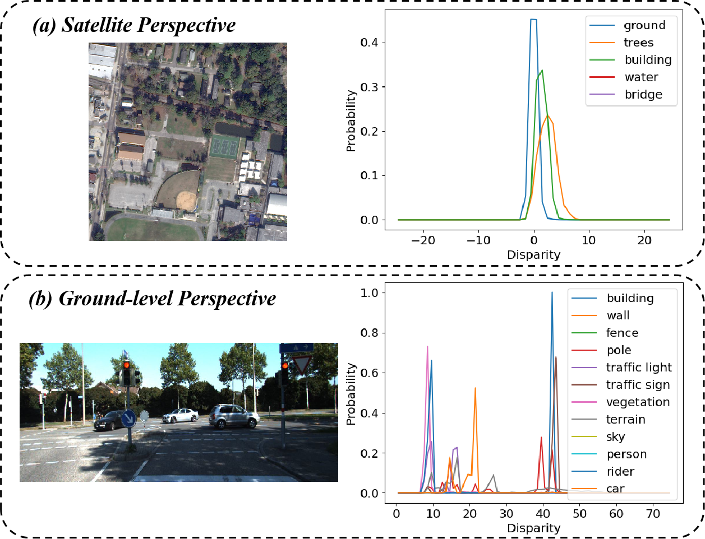
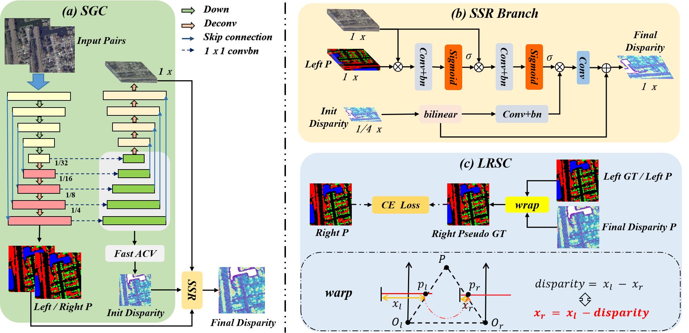

<p align="center">
  <h1 align="center">SemStereo: Semantic-Constrained Stereo Matching Network for Remote Sensing</h1>
  <h3 align="center">AAAI 2025</h3>
  <div align="center"></div>
</p>

## Introduction

Remote sensing semantic 3D reconstruction necessitates the extraction of semantic segmentation contours and precise estimation of height through stereo matching. Current multi-task approaches utilize either a loosely coupled parallel structure with limited shallow features shared or models interactions implicitly, thus ignoring the stronger consistency between tasks due to changes in the observation perspective of remote sensing scenarios. In this work, we explore the connections between the two tasks and propose a new network that imposes semantic constraints on the stereo matching task, both implicitly and explicitly.

<p align="center">
  <a href="">
    
  </a>
</p>
<p align="center">


Remote sensing provides a bird's-eye view with negligible perspective effect (size diminishing with distance), resulting in a single-peak disparity distribution for objects of the same category. This contrasts with street view, where perspective effect leads to a multi-peak form, implying a stronger inter-task consistency in remote sensing.


We propose SemStereo to uncover the connections and bridge the domain gap between semantic categories and disparities in remote sensing.

<p align="center">
  <a href="">
    
  </a>
</p>
<p align="center">
SemStereo
</p>


# How to use

## Environment
* Python 3.7
* Pytorch 1.12
* torchvision 0.13.1


## Install

### Create a virtual environment and activate it.

```
conda create -n semstereo python=3.7
conda activate semstereo
```
### Dependencies

```
conda install pytorch==1.12.1 torchvision==0.13.1 torchaudio==0.12.1 cudatoolkit=11.3 -c pytorch
pip install opencv-python
pip install scikit-image
pip install tensorboardX
pip install matplotlib 
pip install tqdm
pip install timm==0.6.5
```

## Data Preparation
Download [US3D Datasets](https://ieee-dataport.org/open-access/urban-semantic-3d-dataset), [WHU Datasets](http://gpcv.whu.edu.cn/data/WHU_MVS_Stereo_dataset.html).

## Training for US3D
Firstly, train attention weights network for 48 epochs,

```
python main_us3d.py --attention_weights_only True --seg_if True --stereo_if True
```

Then, train the complete network for 48 epochs,

```
python main_us3d.py --attention_weights_only False --seg_if True --stereo_if True
```

## Training for WHU. 

It is worth noting that the semantic supervision here is only the self-supervision of LRSC, because there is no semantic label.

Firstly, train attention weights network for 48 epochs,

```
python main_whu.py --attention_weights_only True --seg_if True
```

Then, train the complete network for 48 epochs,

```
python main_whu.py --attention_weights_only False --seg_if True
```

## Citation

If you find this work useful, please consider citing:

```bibtex
@article{chen2024semstereo,
  title={SemStereo: Semantic-Constrained Stereo Matching Network for Remote Sensing},
  author={Chen, Chen and Zhao, Liangjin and He, Yuanchun and Long, Yingxuan and Chen, Kaiqiang and Wang, Zhirui and Hu, Yanfeng and Sun, Xian},
  journal={arXiv preprint arXiv:2412.12685},
  year={2024}
}